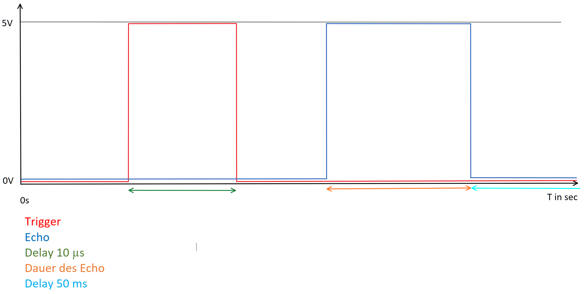

# Arduino Einführung Aufgaben

## [Aufgaben-Datei](https://moodle.hsnr.de/pluginfile.php/640276/mod_resource/content/1/Anleitung_Kennenlernprojekte_WS2021_V3.pdf)

## Aufgabe 1

[Source-Code](https://git.ide3.de/universumgames/esp/-/tags/First-Task)

## Aufgabe 2

[Source-Code](https://git.ide3.de/universumgames/esp/-/tags/Second-Task)

## Aufgabe 3

[Source-Code](https://git.ide3.de/universumgames/esp/-/tags/Third-Task)

### 3 d) Geschwindigkeit von (Ultra-)Schall
Geschwindigkeit von Untraschall in Luft

    Mach 1 = 1234,8 km/h = 343 m/s

### 3 e)

In der oben Abgebildeten Grafik ist ist die Verwendung bzw. eine Messung des HC-SR04 Ultraschallsensors abgebildet. In Rot dargestellt ist hierbei der `Trigger` Pin wohingegen Blau den `Echo` Pin repräsentiert. Nachdem der Trigger Pin für mindestens 10 µs auf 5V gesetzt wird, setzt der Sensor kurz darauf den Echo Pin ebenfalls auf 5V. In diesem Augenblich wird ein Ultrascahllsignal ausgesendet, sobald das Echo jenes gemessen wird, wird der Echo Pin wieder auf 0V gesetzt. Theoretisch kann der Ultraschallsensor mit einer Frequenz von maximal 50 Hz betrieben werden, welches einen Charge-Wechsel des Trigger Pins alle 20 ms bedeuten würde, jedoch kommt es in der Praxis immer auf die Entfernung und somit auf die Dauer des Echo Signals an, wie viel weniger häufig der Sensor die Entfernung pro Sekunde messen kann. Während die Frequenz, um es zu wiederholen, 50 Hz, ist die Amplitude des Signals bei 5V, die Periode läge bei einer Frequenz con 50 Hz somit bei 40 ms.

### 3 f) Ablauf einer Entfernungsmessung
Um die Entferung mittels Ultraschall messen zu können, wird im Prinzip ein kleiner Ultraschalllautsprecher und ein dazugehöriges Mikrofon verwendet. Der Mikrokontroller auf dem Entfernungsmesser sendet bei Eingang eines Signals über den `Trigger`-Pin Ultraschallwellen aus und empfängt ein Echo. Mithilfe der SChallgeschwindigkeit (343 m/s) und der vergangenen Zeit seitdem der Schall ausgesendet worden ist, kann die Entfernung zum Objekt unmittelbar (2-300cm) vor dem Ultraschallsensor errechnet werden. Das Ergebnis dieser Rechnung wird letztendlich über den `Echo`-Pin an den Arduino gesendet. Die `PulseIn()` Funktion des Arduinos wird beim Empfang des Signals verwendet, da die Daten nur über ein Kabel (`Echo`) gesendet werden und speziell "encodiert" sind. Der HC-SR04, so wie der Chip des Ultraschallsensors heißt, stellt den Pin `Echo` proportional (um den Wert 0.017) zur Entfernung auf HIGH (5V). Mithilfe der `PulseIn()` Methode des Arduinos kann die Dauert dieses Wertes gemessen werden und wird letzendlich von der Methode zurückgegeben.
