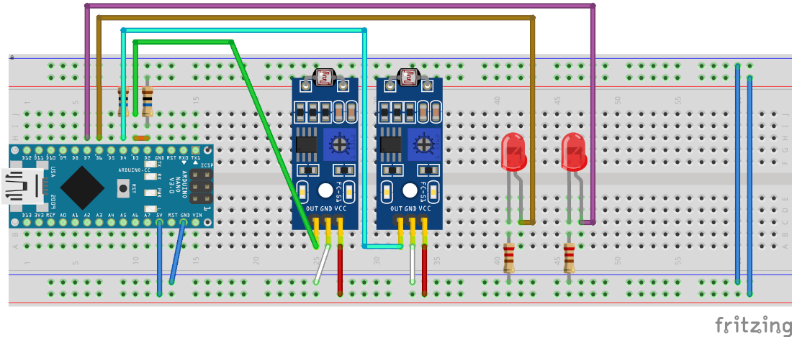

# Dokumentation der Arduino Photokommunikation <br><sub>von Tom Arlt, Florian Körwer, Florian Meyer, Henning Müller, Cong Tai Phan <br><sub>Hochschule Niederrhein FB03, der 03.01.2021</sub></sub>

## Links
- [GitHub link](https://github.com/Universumgames/hsnr_esp)
- [IDE3 link](https://git.ide3.de/universumgames/esp)

## Einleitung
Unsere Aufgabe war es als Gruppe für das Erstsemesterprojekt, im folgenenden "ESP" genannt, zwei Arduinos mithilfe von Leds und Photoresistoren miteinander kommunizieren zu lassen und unsere Arbeit hiermit zu dokumentieren. <br>
Die notwendigen Bauteile wurden uns hierfür pro Person von der Hochschule zur Verfügung gestellt: 
- 1x Arduino Uno
- 2x LM392 mit Photoresistor und Potenziometer
- 1x Breadboard
- 2x 330 Ohm Widerstände
- verschied. LEDs
- verschied. Kabel für das Breadboard
- <s>1x Potenziometer</s>
- <s>1x Ultraschallsensor</s>

Da der Wissensstand innerhalb der Gruppe zum Thema Arduino sehr verschieden war, wurde nur zeitgleich und immer gemeinsam gearbeitet. Die Teilenhmer, welche bereits einiges an Erfahrung mit sich brachten, fungierten eher als Lehrpersonen, die den anderen das nötige Wissen überschaubar vermittelt haben, sodass alle dann gemeinsam die Aufgaben bearbeiten konnten.

## Lösung der Aufgabe
### Strategie
Das Entwickeln der Strategie für die Kommunikation, zu versuchen bereits bestehende Protokolle (als Basis) zu verwenden, war schnell erledigt. Der Versuch die nativen Protokolle des Arduinos zu verwenden scheiterte jedoch schnell, da alle Standardprotokolle viel zu schnell sind um mit LEDs verwendet werden zu können. Hinzukommt, dass uns zunächst entangen ist, dass der LM392 das Signal negiert ausgibt, welches uns erst einiges später auffiel. Schließlich entschlossen wir uns für eine serielle Kommunikation auf Basis des Protokolls [I2C](https://en.wikipedia.org/wiki/I%C2%B2C). Dieses Protokoll ist bei fast jedem modernen Microprocessor Hardwaremäßig implementiert für eine schneller Kommunikation. Bei diesem Protokoll ist in der Regel ein "Master" deklariert und mehrere "Slaves" welche alle gemeinsam an zwei Datenleitungen angeschlossen sind: "Data" und "Clock". Immer wenn die Spannung auf "Clock" von 0V auf 3.3/5V ändert wird auf "Data" der Zustand (Bit) abgelesen, bis sich letztendlich, nach einigen Takten ein Byte (8 Bit) ergeben. Das Standardprotokoll arbeitet eigentlich mit Adressen um zu differnezieren an wen und von wem die Nachricht gesendet wurde. <br>
Unser Protokoll übernimmt dabei nur das Prinzip von "Data" und "Clock", somit kann ein Empfangsmodul nur mit einem Sendermodul verbunden werden und vice versa.

### Unsere Hardware (Schematics)
Hier einmal die Schematics in der Arduino Schematic Software [fritzing](https://fritzing.org/)<br>



In dieser Schematic wurde der zum Arduino Uno funktionsidentische Arduino Nano verwendet und die Grafik übersitchlicher und kompakter zu gestalten. Beide Arduinoversionen besitzen denselben Prozessor (ATmega328P) und dieselben Pins. Die einzigen Unterschiede beider sind zum einen der Formfakor und zum anderen die Möglichkeit des Nanos, direkt auf ein Breadboard gesteckt werden zu können.
Dargestellt wurde hier ein einzelner Arduino, der in der Lage ist sowohl zu Empfangen als auch zu Senden, wenn das passend aufgebaute Gegenstück existiert.

### Software

Unser Programm wurde in C++ für die Arduino IDE geschrieben, schaue man sich frühere Commits an (vor dem 18.12.2020) wurde noch für eine andere IDE gechrieben: PaltformIO welche zwar auf der Arduino IDE basiert, jedoch hier nur eine Extension für die IDE VS Code ist. Einfacheitshalber wurde jedoch entgültig zur Arduino IDE gewechselt.

```cpp
//declare variables
int sender_clock = 6;
int sender_data = 7;
int reciever_clock = 4;
int reciever_data = 3;
int incomingByte = 0;
int reciever_clock_2 = 2;
long long last_millis = 0;
byte temp;
int recieve_index = 7;
byte b;

void setup()
{
  //attach Interrupts to not having to worry about reading from one pin
  attachInterrupt(digitalPinToInterrupt(reciever_clock), clock_interrupt_start, FALLING);
  attachInterrupt(digitalPinToInterrupt(reciever_clock), clock_interrupt_end, RISING);
  //initialize Serial Monitor
  Serial.begin(9600);
  //set pin modes
  pinMode(sender_clock, OUTPUT);
  pinMode(sender_data, OUTPUT);
  pinMode(reciever_clock, INPUT);
  pinMode(reciever_data, INPUT);
  pinMode(reciever_clock_2, INPUT);
}

void loop()
{
  //check if serial queue contains items
  if (Serial.available() > 0)
  {
    //read incoming byte (charactere)
    incomingByte = Serial.read();
    //send each bit seperately to serial monitor for debugging and to other arduino
    for (int i = 7; i >= 0; i--)
    {
      Serial.print(bitRead(incomingByte, i));
      sendBit(bitRead(incomingByte, i));
    }
    Serial.println();
  }
}

//read incoming bits
void clock_interrupt_start()
{
  bool dataval = !digitalRead(reciever_data);
  bitWrite(temp, recieve_index, dataval);
}

//verify incoming bit
void clock_interrupt_end()
{
  //calculate delta since clock fell, to check for hazards
  unsigned long delta = millis() - last_millis;
  //if delta > 100ms, it's nit a hazard or glitch from the photoresistor
  if (delta > 100)
  {
    //write temporary byte to "longterm" byte
    b = temp;
    //reduce recieve index to move to next bit
    recieve_index--;
    //if recieve_index < 0 we have successfully recieved a byte and print that to the serial monitor
    if (recieve_index < 0)
    {
      Serial.print(b);
      //reset recieving variables to default state
      recieve_index = 7;
      b = 0x0;
    }
    //reset for delta caluclation
    last_millis = millis();
  }
  else
  {
    //if a glitch was detected, delete temporarily recieved bit
    temp = b;
  }
}

//send single bit
void sendBit(bool bitt)
{
  //change data pin
  digitalWrite(sender_data, bitt);
  delayMicroseconds(10);
  //change clock to HIGH
  digitalWrite(sender_clock, HIGH);
  //wait to be able to differentiate between valid bit and a hazard
  delayMicroseconds(500);
  //change both pins to default state
  digitalWrite(sender_clock, LOW);
  digitalWrite(sender_data, LOW);
  delayMicroseconds(5);
}
```

Link zum Aktuellen Programmcode: [Github](https://github.com/Universumgames/hsnr_esp/tree/master/LightCom), [IDE3](https://git.ide3.de/universumgames/esp/-/tree/master/LightCom) <br>
Link zum aufbereiteten/alternativen Code (eigenständig entwickelt von Tom Arlt):  [Github](https://github.com/Universumgames/hsnr_esp/tree/universumgames/LightCom), [IDE3](https://git.ide3.de/universumgames/esp/-/tree/universumgames/LightCom)

## Verwendung
(Übersetzt und aufbereitet aus [Readme.md](Readme.md))
Um unser Projekt zu verwenden, müssen zwei Schaltungen aufgebaut sein, wobei mindestens zwei LEDs und zwei Empfänger aufgebaut sein müssen, um zumindest die Einseitige Kommunikation testen zu können. Zu beachten ist, dass jedes LED-LM392 Paar zu allen anderen Paaren abgeschirmt sein sollte, da es sonst zu Interferrenzen kommen kann. Zudem muss das Potenziometer des LM392 eingestellt werden nur die dazugehörige eingeschaltete LED zu erkennen und nicht das Umgebungslicht. Bei der Erstellung der LED-LM392 Paare ist auf die Unterscheidung zwischen "Data" und "Clock" zu achten:
<pre>
Arduino 1       <-> Arduino 2
sender_clock    <-> reciever_clock
sender_data     <-> reciever_data
reciever_clock  <-> sender_clock
reciever_data   <-> sender_data
</pre>

Ist das Programm einmal auf beiden Arduinos hochgeladen, ist die Arduino IDE (o.ä.) nicht mehr notwendig. Nun kann über einen Seriellen Monitor, wie zum Beispiel der intergrierte Monitor der [Arduino IDE](https://www.arduino.cc/en/software) oder  [Putty](https://www.putty.org/) über den Arduino kommuniziert werden. In diesen Tools muss noch der Port, über den der Arduino angeschlossen ist, angegeben werden, sowie die Baud Rate des Seriellen Monitor, welche hier `9600` beträgt.

## Reflexion
Wie schon in `Strategie` erwähnt, war die grundsätzliche Strategie schnell gefunden, nur das ausarbeiten hat, dank der Rückschläge, etwas länger gedauert.
Nach den ersten Rückschlägen und das Festsetzen auf die entgültige Implementationsstrategie war auch das Entwickeln eines ersten Gerüsts relativ straight forward. Das Debuggen sowie ein ordentlicher Aufbau der Schaltung war dann die größere Herausforderung. Da durch ständig wechselnde Lichtverhältnisse der Photoresistor nicht immer wie gewünscht funktionierte, verzögerte sich das Programm-Debuggen ungemein. Erst nach vielen Stunden rumgrübelns, rumschrauben und ausprobieren, stellte sich als einzige zuverlässige Methode eine eigene Blackbox für jedes LED-LM392 Paar heraus. 

## Zusammenfassung
Die Aufgaben waren, wenn auch leicht missverständlich organisiert, einfach zu bearbeiten. Wir hatten schnell eine grundsätzliche Strategie für die Programmentwicklung gefunden und hatten binnen einiger Stunden nach den Fehlversuchen einen ersten ordentlichen Prototypen stehen. Somit hatten wir die grundsätzliche Aufgabe "zwei Arduinos mithilfe von LEDs und LDRs kommunizieren zu lassen" gelöst. Währenddessen sich die Ersten bereits an die Dokumentation gesetzt hatten, haben sich andere im Internet auf die Suche gemacht ein angemessenes Schematic-Tool ausfindig zu machen und eine digitale Schaltung zu erstellen.<br>
Erst später, als alle gemeinsam an der Dokumentation arbeiteten, fiel auf, dass die Aufgaben der Anleitung zum Kommunikationssystem zu bearbeiten sind. Als die Dokumentation bereits in den letzten Zügen war, wurden die zusätzlichen Aufgaben fertiggestellt, dabei schafften wir es jedoch nicht die Kommunikation der Arduinos mithilfe dieser Aufgaben über die digitalen Kommunikationswege erfolgreich zu realisieren, da die Photoresistoren die LEDs nur unzureichend erkennen konnten. Zusätzlich kamen noch Timingproblemen hinzu, die durch die Kommunikation entstanden sind.<br>
Ingesamt hat die Gruppe gut zusammengearbeitet und ist recht zügig zu einer ersten Lösung gekommen.